# Creating an Azure Linux VM via Portal

## Prerequisites
- An active Azure subscription
- Azure account with necessary permissions to create resources

## Steps to Create an Azure Linux VM

1. **Sign in to Azure Portal**
    - Go to [Azure Portal](https://portal.azure.com) and sign in with your Azure account.

2. **Create a Resource**
    - Click on the `Create a resource` button on the left-hand menu.

3. **Select Virtual Machine**
    - In the `New` page, select `Compute` and then choose `Virtual Machine`.
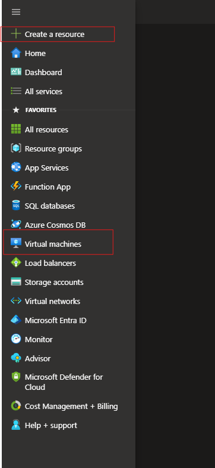
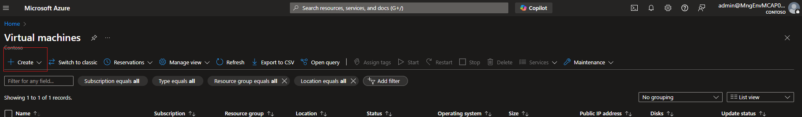

4. **Configure Basic Settings**
    - **Subscription**: Select your subscription.
    - **Resource Group**: Create a new resource group or select an existing one. I am creating a new one in this instance.
    - **Virtual Machine Name**: Enter a name for your VM.
    - **Region**: Choose the region where you want to deploy the VM.
    - **Availability Options**: Select the availability options as per your requirement. I am not using availability options as this is just for demostration purposes.
    - **Image**: Choose the Linux distribution you want to use (e.g., Ubuntu, CentOS).
    - **Size**: Select the VM size based on your needs. I will be using a small size vm as I do not need to incure much costs for this demo.
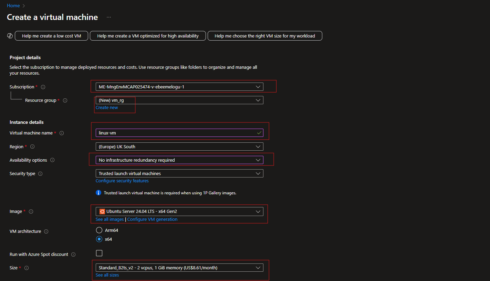

5. **Administrator Account**
    - **Authentication Type**: Choose SSH public key or password. I am using SSH here and generating a new key pair on Azure.
    - **Username**: Enter a username for the VM.
    - **SSH Public Key**: If using SSH, paste your public key here. (Optional)
    - **Give the SSH key a Name**: Name the SSH key a name easy to remember.
    - **Allow Port**: 22 for SSH access
    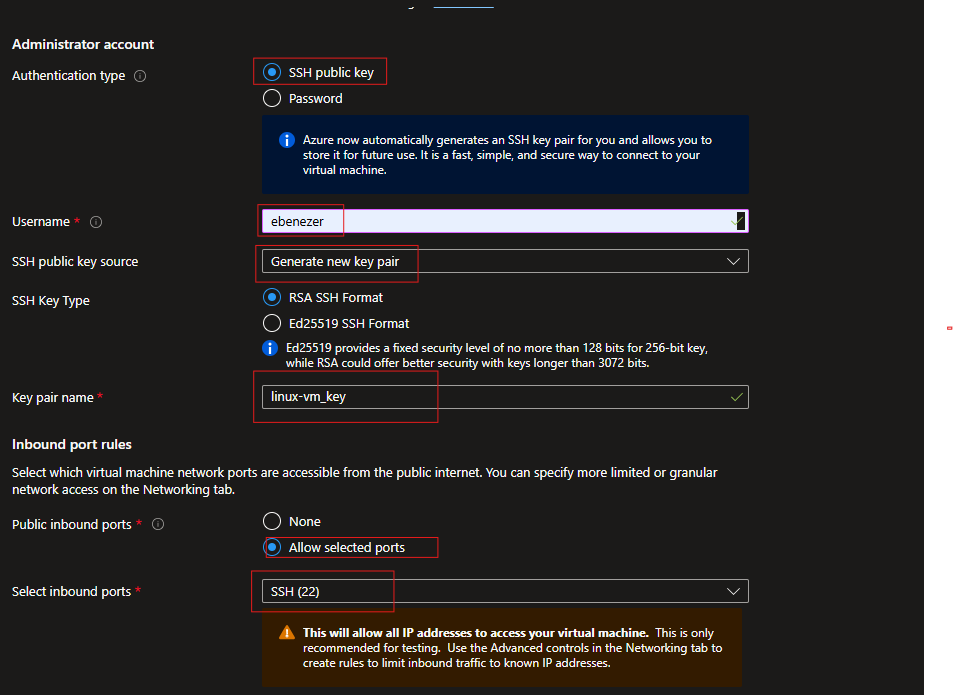

6. **Disks**
    - Configure the OS disk and any additional data disks as needed.
    for this demo I am using a standard HDD to minimize cost as this is a non production environment.
    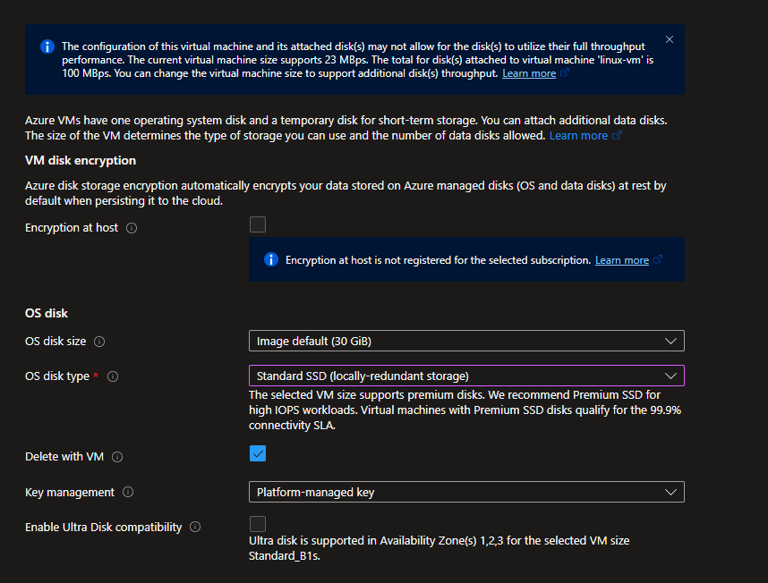

7. **Networking**
    - Configure the virtual network, subnet, public IP, and network security group (NSG).
    ICreate a new Vnet, Subnet and a new Public IP for this virtual machine 
    Also check delete the Public IP and NIC when the VM is deleted.
    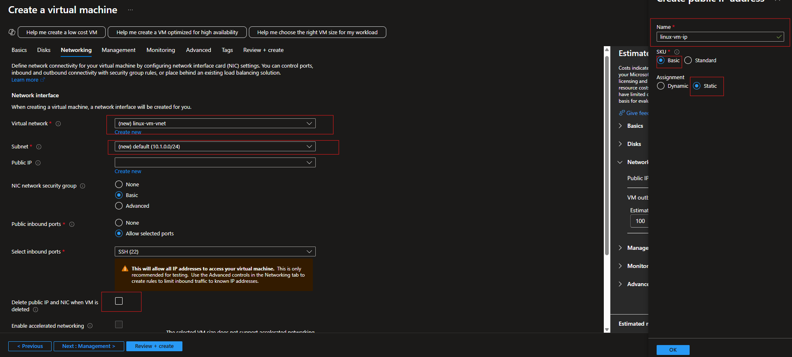

8. **Tags**
     - Add tags to organize your resources.
     I am tagging this as a Hybrid enviromnet resource for ease of organization.
     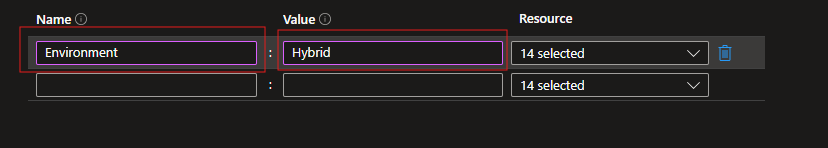

9. **Review + Create**
     - Review all the settings and click on `Create` to deploy the VM.
     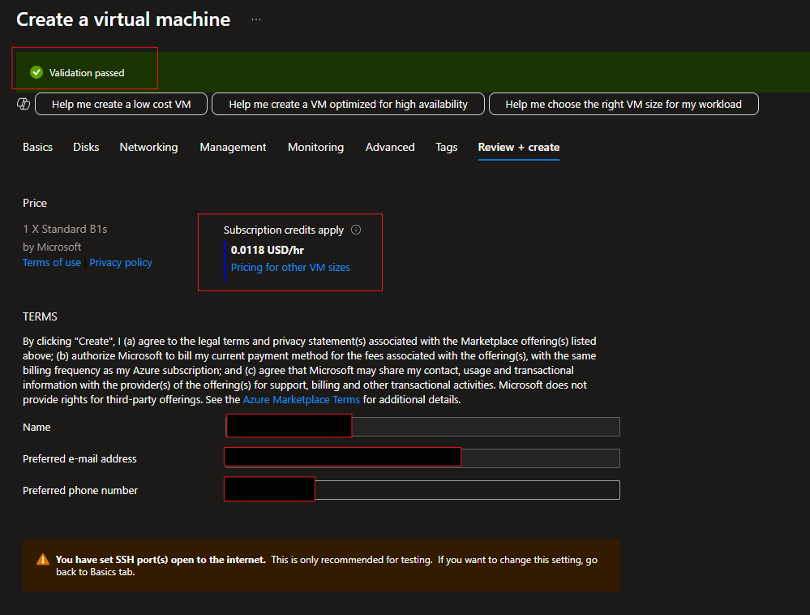 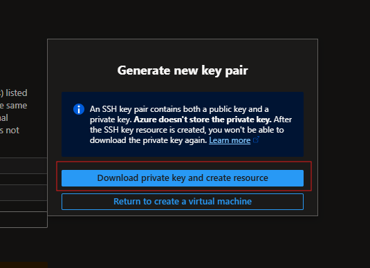 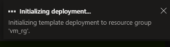 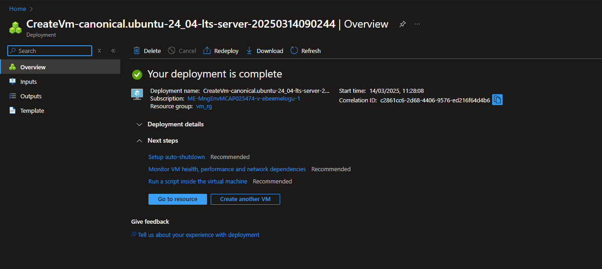

## Post-Deployment
- Once the VM is created, you can connect to it using SSH:
  ```sh
  ssh -i .linux-vm_key.pem ebenezer@4.234.222.99
  ```
  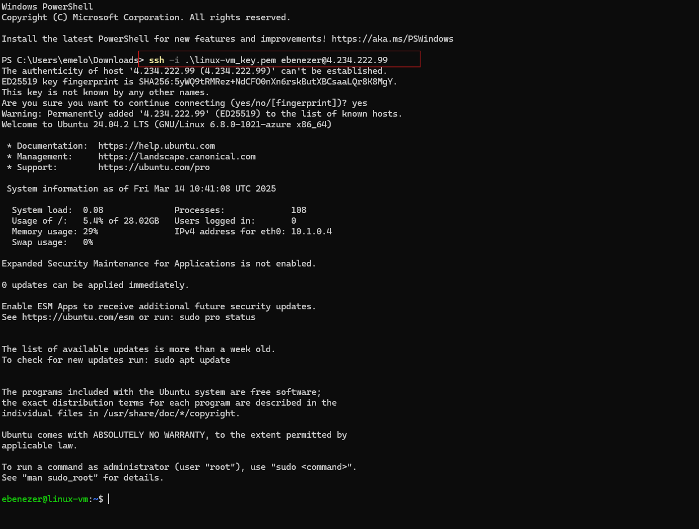

## Additional Resources
- [Azure Virtual Machines Documentation](https://docs.microsoft.com/en-us/azure/virtual-machines/)
- [Quickstart: Create a Linux VM](https://docs.microsoft.com/en-us/azure/virtual-machines/linux/quick-create-portal)
